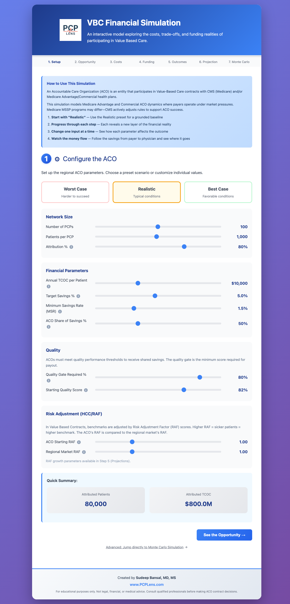
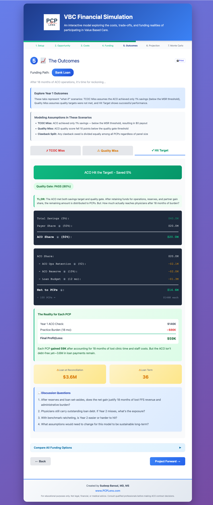
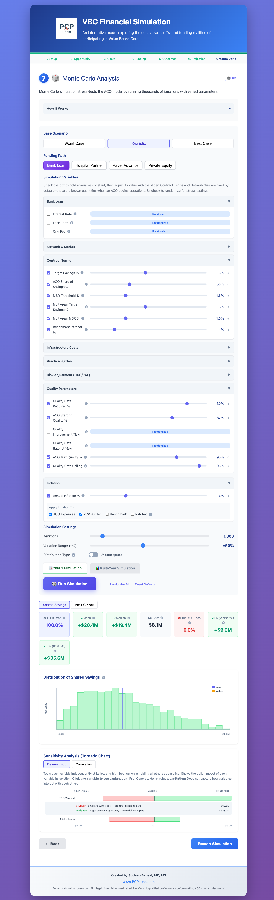

# VBC Financial Simulation

An interactive model exploring the costs, trade-offs, and funding realities of participating in Value-Based Care.

**[Live Demo](https://vbcsim.pcplens.com/)**

## Screenshots

| Setup & Configuration | Year 1 Outcomes | Monte Carlo Analysis |
|:---:|:---:|:---:|
|  |  |  |

## Features

- **7-step guided wizard** walking through ACO financial mechanics from setup to advanced analysis
- **4 funding models** — Bank Loan, Hospital Partnership, Payer Advance, Private Equity — each with distinct financial terms and trade-offs
- **Multi-year projections** (up to 20 years) with benchmark ratcheting, RAF tracking, quality gate dynamics, and reserve modeling
- **Monte Carlo simulation** using Quasi-Monte Carlo (Sobol) sampling with tornado sensitivity charts
- **Three presets** — Worst Case, Realistic, Best Case — for quick scenario comparison
- **Mobile responsive** design for use on any device
- **No dependencies** — pure HTML, CSS, and JavaScript; runs entirely in the browser

## Getting Started

Visit the **[live demo](https://vbcsim.pcplens.com/)** or run locally:

```bash
git clone https://github.com/pcplens/vbc-simulation.git
cd vbc-simulation
python3 -m http.server
# Open http://localhost:8000
```

## Author

Sudeep Bansal, MD, MS — [PCPLens.com](https://www.pcplens.com)

## License

This work is licensed under [CC BY-NC 4.0](https://creativecommons.org/licenses/by-nc/4.0/).
